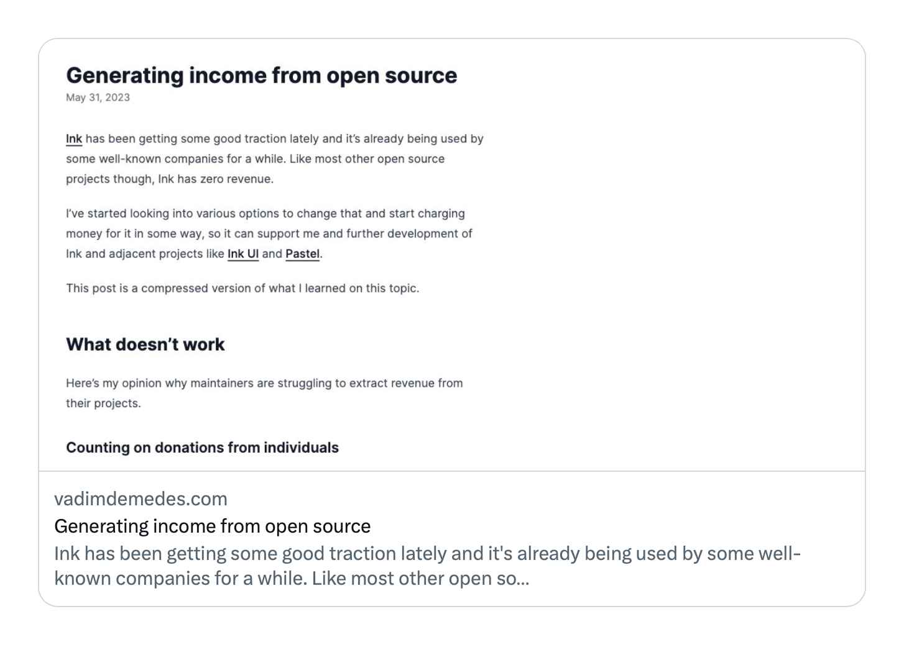

# astro-selfie [](https://github.com/vadimdemedes/astro-selfie/actions/workflows/test.yml)

> [Astro](https://astro.build) integration to generate page screenshots to show as Open Graph images.

I use this extension on [my website](https://vadimdemedes.com) and my link previews on Twitter look [like this](https://twitter.com/vadimdemedes/status/1664261504168755201):



## Install

```console
npm install --save-dev astro-selfie
```

## Usage

### 1. Set up integration

Add this integration to `astro.config.mjs`:

```diff
import {defineConfig} from 'astro/config';
+ import selfie from 'astro-selfie';

export default defineConfig({
+    integrations: [
+        // Make sure `astro-selfie` only runs locally
+        !process.env['CI'] && !process.env['VERCEL'] && selfie()
+    ].filter(Boolean)
});
```

This integration is meant to be used locally for statically built websites for several reasons:

1. Websites deployed to Vercel don't have access to headless Chrome due to platform limitations.
2. Open graph images aren't probably useful in continuous integration.
3. Taking screenshots is not quick.

### 2. Add meta tags

Then, add a `<meta>` tag to each page that points to a screenshot of itself.

```jsx
---
import {selfieUrl} from 'astro-selfie';

const screenshotUrl = selfieUrl(Astro);
---
<meta
	property="og:image"
    content={screenshotUrl.href}
/>
```

### 3. Customize styles (optional)

Selfie adds a `data-astro-selfie` attribute to `body` when taking a screenshot. You can use that data attribute to change any styles in CSS to make sure page looks good.

For example:

```css
body[data-astro-selfie] .container {
	padding: 32px 64px;
}
```

### 4. Generate screenshots

Run a build command to take screenshots of all pages and store them in `public/og` directory.

```console
npx astro build
```

Once screenshots are generated, commit them to version control and deploy.

## API

### selfie()

Returns an Astro integration that takes page screenshots.

### selfieUrl(astro): URL

Returns a URL to the screenshot of the current page.

#### astro

Type: `AstroGlobal`

Global `Astro` object.
